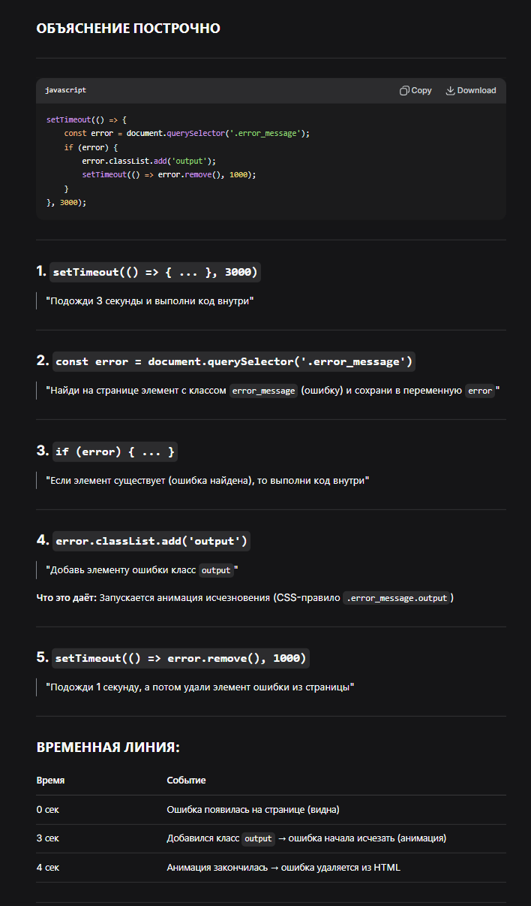

// onscroll	СЛЕДИТ за прокруткой (слушает)
// scrollTo	ВЫПОЛНЯЕТ прокрутку (действует)

    

// // Уведомления ДЛЯ ЛЕКЦИИ
// setTimeout(()=> {
//     const error = document.querySelector('.error_message')
//     if(error) {
//         error.classList.add('output')
//         setTimeout(()=> error.remove(), 1000)
//     }  
// },3000)

// const hasError = document.querySelector('.error_message')
// if (hasError) {
//     document.querySelector('.pdf').scrollIntoView({behavior: 'smooth'})
//     applicationBlock.style.display = 'flex'
// }